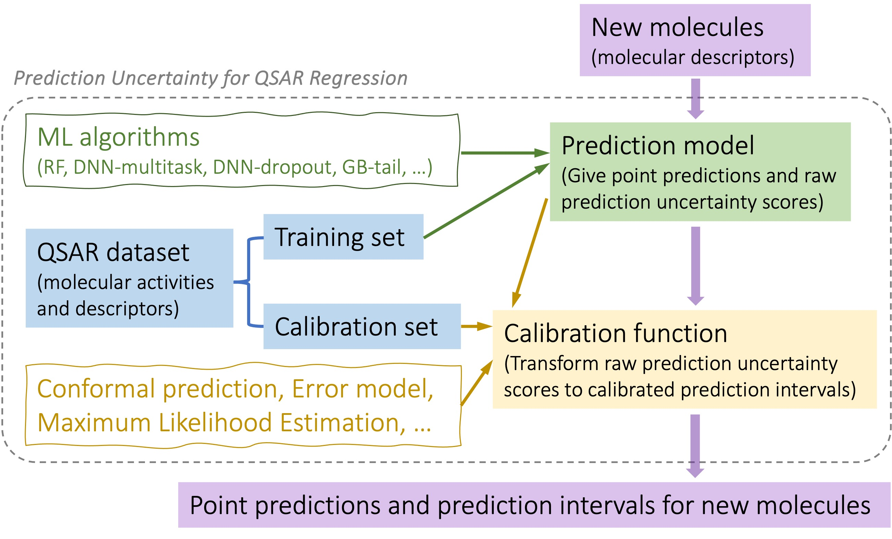

# Prediction Uncertainty for QSAR

This package contains Python code to construct prediction intervals for QSAR regression.
The implemented QSAR prediction models include: Random Forests, Fully-Connected Neural Networks, and Gradient Boosting.
The methodology for developing prediction intervals accompanying the point predictors can be find in Reference [1] and [2].

Developer & Maintainer: Yuting Xu (Merck & Co., Inc.) <yuting.xu@merck.com>

Last updated: Jul. 13th, 2024

## Workflow

  

## Usage

The code is written in the functional programming paradigm without the hassle of installation.
Simply clone or download the repository to your local machine, and use the provided examples as a starting point to experiment with your own workflow.

### Prerequisites

* numpy
* pandas
* dill
* scipy
* scikit-learn
* tensorflow
* keras
* lightgbm

## Reference

[1] Xu, Y., Liaw, A., Sheridan, R. P., & Svetnik, V. (2024). Development and Evaluation of Conformal Prediction Methods for Quantitative Structure–Activity Relationship. ACS Omega. [Link](https://pubs.acs.org/doi/full/10.1021/acsomega.4c02017)

[2] Cortes-Ciriano, I.; Bender, A. Reliable prediction errors for deep neural networks using test-time dropout. Journal of chemical information and modeling 2019, 59, 3330–3339.

## License
This project is licensed under the GNU General Public License v3.0 License - see the [LICENSE](LICENSE) file for details.
